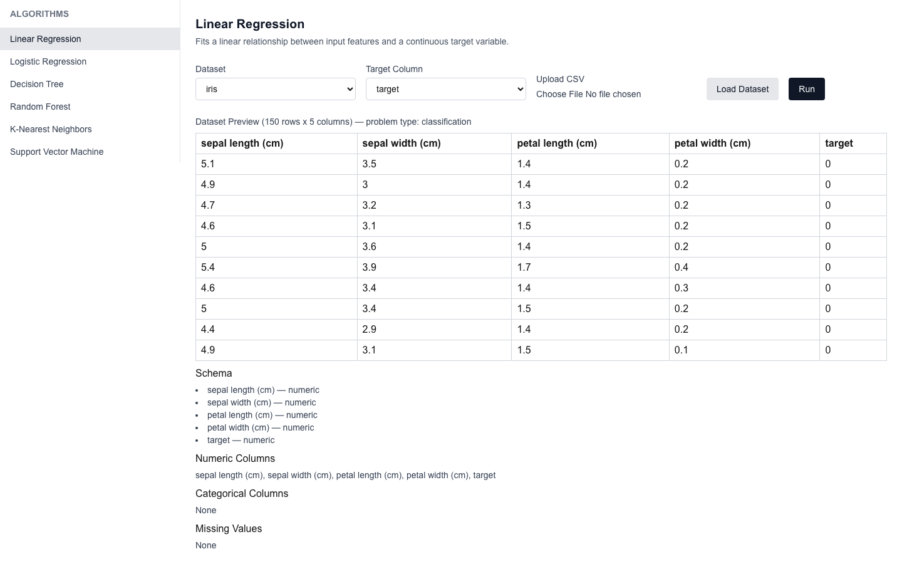
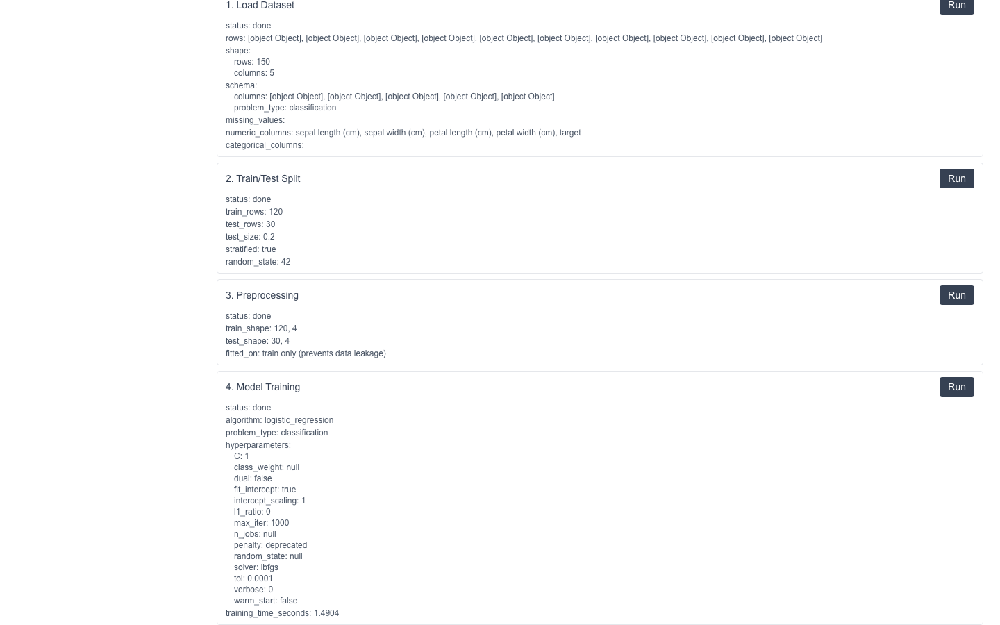
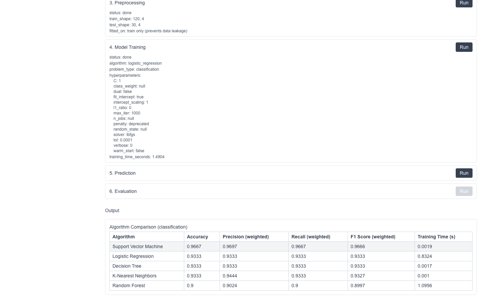

# Interactive ML

An educational platform for exploring how ML pipelines actually work — stage by stage, not just a form that returns a prediction.

**Live demo: [interactive-ml-kappa.vercel.app](https://interactive-ml-kappa.vercel.app/)**

> Note: the backend runs on Render's free tier, so the first request after a period of inactivity can take 30-50 seconds while the instance cold-starts.

## Why this exists

Most beginner ML demos hide everything behind a single "predict" button. This project does the opposite: it exposes each stage of a real scikit-learn pipeline — load, split, preprocess, train, predict, evaluate — as an independent, inspectable step, so you can see exactly what happens to the data at each point (shapes, fitted transforms, hyperparameters, metrics) instead of treating the model as a black box. It's built for understanding the mechanics of the pipeline, not for production inference.

## Features

- **Built-in datasets + CSV upload** — start with iris, wine, or California housing, or upload your own CSV and pick a target column.
- **Schema-aware auto-preprocessing** — numeric and categorical columns are detected automatically and routed through the appropriate transforms, whether the data came from a built-in dataset or an upload.
- **Stage-by-stage pipeline execution** — run load, split, preprocess, train, predict, and evaluate individually and inspect each stage's output, or run the entire pipeline in one click.
- **Multi-algorithm comparison** — evaluate every applicable algorithm (linear/logistic regression, decision tree, random forest, KNN, SVM) on the same train/test split and rank them by performance.

## Tech stack

| Layer | Technology |
|---|---|
| Frontend | Next.js, TypeScript, Tailwind CSS |
| Backend | FastAPI (Python) |
| ML | scikit-learn, pandas |
| Deployment | Vercel (frontend), Render (backend) |

## Key engineering decisions

**Generic schema-driven pipeline.** Every dataset — built-in or uploaded CSV — is passed through the same code path. Columns are classified as numeric or categorical by pandas dtype at load time, and that schema drives preprocessing, algorithm selection, and comparison. There's no special-cased logic for "the iris dataset" versus "a user's CSV"; they're indistinguishable once loaded.

**Leakage-safe preprocessing.** The train/test split happens *before* preprocessing, and the `ColumnTransformer` (imputer + scaler for numeric columns, imputer + one-hot encoder for categorical columns) is fit only on the training split. The test split is only ever transformed, never fit on — so no information from the test set leaks into the preprocessing statistics.

**Session-based stage architecture.** Each pipeline stage (load, split, preprocess, train, predict, evaluate) is an independent endpoint that reads its prerequisites from an in-memory session and writes its own output back to it. Because every stage is self-contained and stage-order is enforced by declared prerequisites rather than hardcoded sequencing, the same endpoints power both manual step-by-step execution and the one-click "Run Entire Pipeline" flow.

**Fair algorithm comparison.** The train/test split is fixed per session (`random_state=42`), so when the comparison stage fits every candidate algorithm, each one sees exactly the same training data and is scored against exactly the same test set. That's what makes the resulting ranking a meaningful comparison rather than an artifact of different random splits.

## Local setup

### Backend (FastAPI)

```bash
cd backend
python3 -m venv venv
source venv/bin/activate
pip install -r requirements.txt
uvicorn main:app --reload --port 8000
```

Environment variables (see `backend/.env.example`):

| Variable | Description | Default |
|---|---|---|
| `ALLOWED_ORIGINS` | Comma-separated list of allowed CORS origins | `http://localhost:3000` |

### Frontend (Next.js)

```bash
cd frontend
npm install
npm run dev
```

Environment variables (see `frontend/.env.example`):

| Variable | Description | Default |
|---|---|---|
| `NEXT_PUBLIC_API_URL` | Base URL of the backend API | `http://localhost:8000` |

### Deployment notes

- **Frontend → Vercel**: deploy the `frontend/` directory, and set `NEXT_PUBLIC_API_URL` to your deployed backend's URL.
- **Backend → Render/Railway**: deploy the `backend/` directory, set `ALLOWED_ORIGINS` to your deployed frontend's origin, and use the start command:
  ```
  uvicorn main:app --host 0.0.0.0 --port $PORT
  ```

### Note on `california_housing`

The `california_housing` built-in dataset is fetched over the network on first use (scikit-learn downloads and caches it locally). This requires outbound network access from wherever the backend runs. On macOS, if you hit an SSL certificate verification error fetching it locally, set `SSL_CERT_FILE` to your `certifi` bundle before starting the server:

```bash
SSL_CERT_FILE=$(python3 -c "import certifi; print(certifi.where())") uvicorn main:app --reload --port 8000
```

## Screenshots

**Dataset preview** — the iris dataset loaded, with its inferred schema (numeric/categorical columns, missing values) shown alongside a preview of the raw rows.



**Pipeline execution** — stages run independently, each showing its own status and summary (split sizes, preprocessing shapes, fitted hyperparameters) as they complete.



**Algorithm comparison** — every applicable algorithm evaluated on the same split, ranked best-first, with the top performer highlighted.



## Known limitations

- **In-memory session storage** — pipeline state lives in the backend process's memory, not a database. Sessions are lost on server restart, and the app isn't designed for concurrent multi-user production use.
- **Render free-tier cold start** — the backend spins down after periods of inactivity; the first request afterward can take 30-50 seconds.
- **No authentication** — this is a single-user/demo application with no login or access control.

## License

MIT — see [LICENSE](LICENSE).
